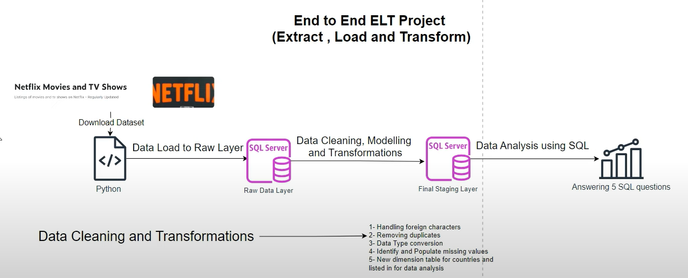

# Netflix Data Analysis

## Project Overview

This project aims to analyze Netflix data to gain insights into the content available on the platform. The analysis involves understanding trends in movie_type,release_date, genres, countries, casts, and directors. The project follows an ELT (Extract, Load, Transform) approach using SQL for data transformation and analysis.

## FLOW

## Dataset

- **Source**: Kaggle
- **Dataset**: [Netflix Shows](https://www.kaggle.com/datasets/shivamb/netflix-shows)

## Project Components

### 1. Jupyter Notebook: `Netflix_Data_Analysis.ipynb`

The Jupyter Notebook contains the following steps:

1. **Data Download and Extraction**:
   - Using the Kaggle API to download the dataset.
   - Extracting the downloaded dataset using Python's `zipfile` library.

2. **Database Connection and Data Loading**:
   - Establishing a connection to the MS SQL database using SQLAlchemy.
   - Loading the dataset into the MS SQL database.

  you can find the code here. {add link}

### 2. SQL Script: `Netflix_Data_Analysis.sql`

The SQL script performs the following data transformations and analysis:

1. **Table Structure Definition**:
   - Defining the structure of the tables for normalized data (genres, countries, cast, director).

2. **Data Cleaning**:
   - Removing duplicate records.
   - Balancing null values by filling them with default values or handling them appropriately.

3. **Data Transformation**:
   - Splitting columns like Genre, Country, Cast, and Director based on comma delimiter and creating separate tables with prefix `Netflix`.
  
      ### List of Tables
      
      - **netflix_raw_data**: Original Data
      - **netflix_stg_data**: Transformed Data
      - **netflix_genre**: Converted `listed_in` column to table
      - **netflix_director**: Converted `director` column to table
      - **netflix_country**: Converted `country` column to table
      - **netflix_cast**: Converted `cast` column to table

4. **Analysis Questions**:
   - Counting the number of movies and TV shows for each director who has created both.
   - Identifying the country with the highest number of comedy movies.
   - Finding the director with the maximum number of movies released each year.
   - Calculating the average duration of movies in each genre.
   - Listing directors who have created both horror and comedy movies, along with the number of movies in each genre.

## What I Analyzed?

1. **Director-wise Count of Movies and TV Shows**:
   
   - For each director, count the number of movies and TV shows they have created, but only for directors who have created both.
    - Observation: A total of 83 directors have directed both movies and TV shows on Netflix.
    - Top Director: Marcus Roby stands out as the most prolific, having directed 15 movies.
    - Notable Directors: Alastair Fothergill and Ken Burns have directed the highest number of TV shows, with 3 each.

2. **Country with Highest Number of Comedy Movies**:
   - Identify the country with the highest number of comedy movies.
    - Top Country: The United States leads with a total of 685 comedy movies available on Netflix.

3. **Top Director by Year**:
   - For each year (based on the date added to Netflix), find the director with the maximum number of movies released.
    - 2008: Sorin Dan Mihalcescu with 1 movie.
    - 2009: Joe Dante with 1 movie.
    - 2010: Jim Monaco with 1 movie.
    - 2011: Icíar Bollaín with 1 movie.
    - 2012: Matt Piedmont with 1 movie.
    - 2013: Will Lovelace with 1 movie.
    - 2014: Leo Riley with 2 movies.
    - 2015: Jay Karas with 2 movies.
    - 2016: Jay Karas with 4 movies.
    - 2017: Umesh Mehra with 7 movies.
    - 2018: Jan Suter with 12 movies.
    - 2019: Cathy Garcia-Molina with 7 movies.
    - 2020: Youssef Chahine with 11 movies.
    - 2021: Rajiv Chilaka with 17 movies.

4. **Average Duration of Movies by Genre**:
   - Calculate the average duration of movies for each genre.
   - Classical Genre: Classical movies have the highest average duration of 118 minutes.

5. **Directors of Both Horror and Comedy Movies**:
   - Find directors who have created both horror and comedy movies, displaying their names along with the number of comedy and horror movies directed by them.
   - Observed 55 Directors have created both horror and comedy movies.

## How to Use

1. **Run the Jupyter Notebook**:
   - Ensure you have the necessary libraries installed (Kaggle API, SQLAlchemy, pandas).
   - Execute the `Netflix_Data_Analysis.ipynb` notebook to download, unzip, and load the data into the MS SQL database.

2. **Run the SQL Script**:
   - Execute the `Netflix_Data_Analysis.sql` script in your SQL environment to perform data transformation and analysis.

## Requirements

- Python 3.x
- Jupyter Notebook
- Kaggle API
- SQLAlchemy
- MS SQL Server
- Pandas

## Contributing

Contributions are welcome! Please fork this repository and submit a pull request with your improvements.
